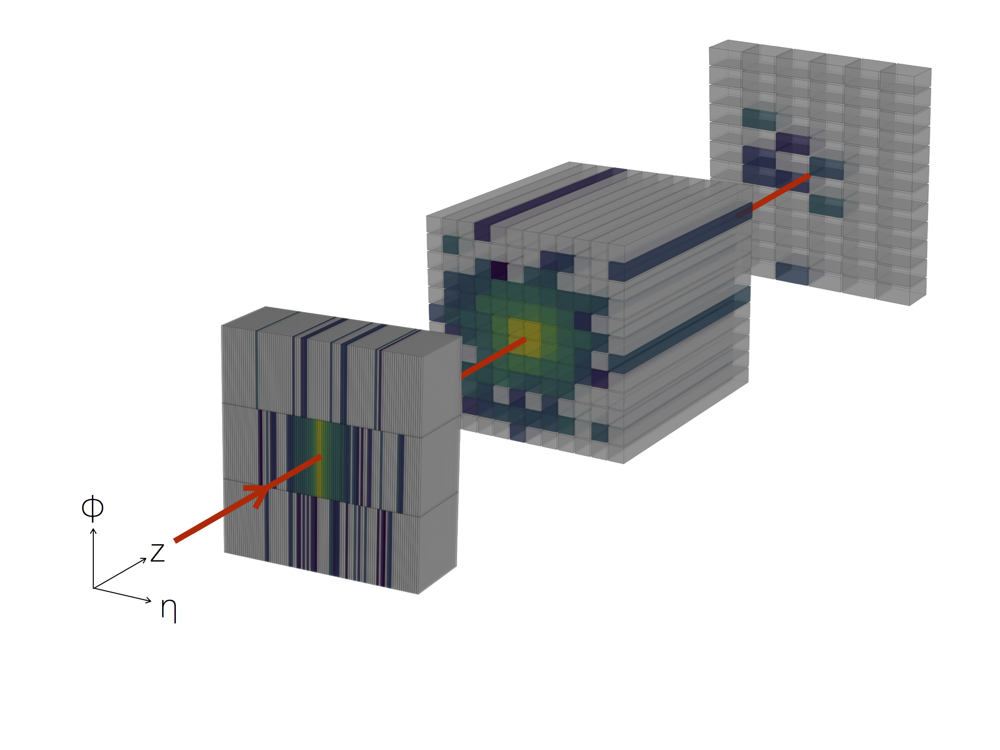
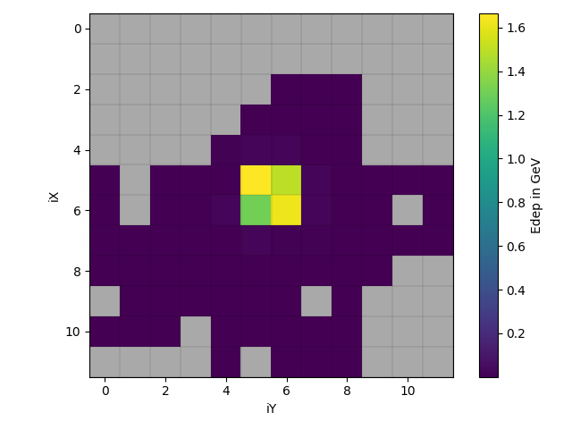
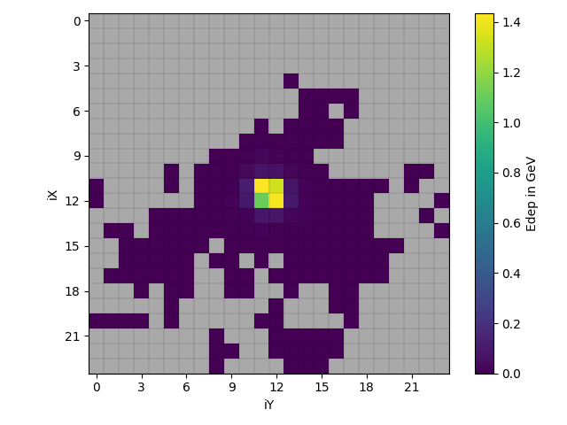
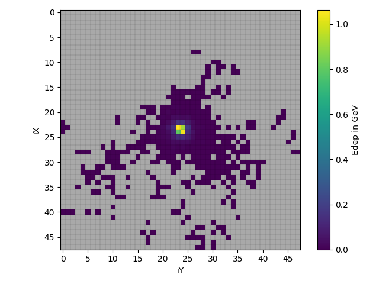

# A voxelized lAr calorimeter Geant4 simulation
<div align="center">
    
</div>
This repository is highly influenced by [this one](https://github.com/hep-lbdl/CaloGAN) by M. Paganini ([@mickypaganini](https://github.com/mickypaganini)), L. de Oliveira ([@lukedeo](https://github.com/lukedeo)), B. Nachman ([@bnachman](https://github.com/bnachman)), _CaloGAN: Simulating 3D High Energy Particle Showers in Multi-Layer Electromagnetic Calorimeters with Generative Adversarial Networks_ [[`arXiv:1705.02355`](https://arxiv.org/abs/1705.02355)]. It should be cited as follows:

```
@article{paganini_calogan,
      author         = "Paganini, Michela and de Oliveira, Luke and Nachman,
                        Benjamin",
      title          = "{CaloGAN: Simulating 3D High Energy Particle Showers in
                        Multi-Layer Electromagnetic Calorimeters with Generative
                        Adversarial Networks}",
      year           = "2017",
      eprint         = "1705.02355",
      archivePrefix  = "arXiv",
      primaryClass   = "hep-ex",
}
```

## Goal of this Geant4 application
This application creates energy deposition maps of the second layer with different granularities. In the default state, the base resolution (12x12), 2x and 4x the base resolution are available. Those images can then be used to train superresolution networks.

<div>
  <p float="left">
    
     
    
  </p>
</div>

## Usage
To run the code, you need Geant4. The application was developed and tested with Geant4 10.6.2. On E4 IT, you can get Geant4 software via CVMFS, e.g. in LCG 97:

```
source /cvmfs/sft.cern.ch/lcg/views/LCG_97/x86_64-centos7-gcc8-opt/setup.sh
```

To build the application, create a build directory and compile the code with the following commands:

```
mkdir build
cd build
cmake ..
make
```

You can then go and run a simple example with:

```
./sim ../macros/run.mac
```

If you want to see a Geant4 visualization of the simulation, you can uncomment the line 

```
#/control/execute ../macros/init_vis.mac
```

in `run.mac`. In that case, you will have to run the example with the following command:

```
./sim ../macros/run.mac true
```

The outputs are written by default into the `outputs` folder. To visualize the results, you can use the python script in `scripts`:

```
python ./scripts/plot_edep_slices.py <file(s).csv>
```